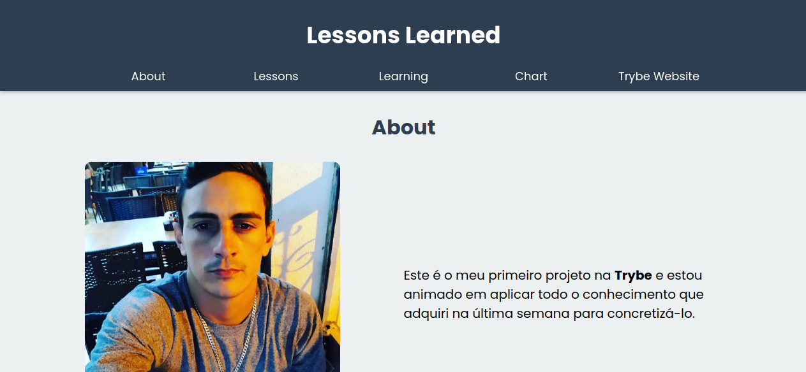

# :pushpin: Lessons Learned

Você pode ver o projeto em seu navegador [clicando aqui](#/)

## :pencil: Sobre

Projeto desenvolvido com _HTML_ e _CSS_ por [mim](https://www.linkedin.com/in/felipeclemente2012/) para o fim do bloco 03 do módulo de [Fundamentos](#) do Curso de Desenvolvimento Web da [Trybe](https://betrybe.com).

O projeto consistia em desenvolver um site usando `HTML` e `CSS` que contivesse uma série de informações sobre o que nós aprendemos na **Trybe** ao longo dos primeiros três blocos. O site deveria estar com _elementos posicionados_ e _estilizados_ e além disto, deveria conter _semântica_ apropriada para que seja _acessível_ e melhor ranqueado.

## :hammer: Habilidades

**Com esse projeto fui capaz de:**

- Utilizar _HTML_ para construir páginas WEB.
- Utilizar _HTML_ semântico para tornar minha página mais acessível e melhor ranqueada.
- Utilizar _CSS_ para adicionar estilo e posicionar elementos. 
